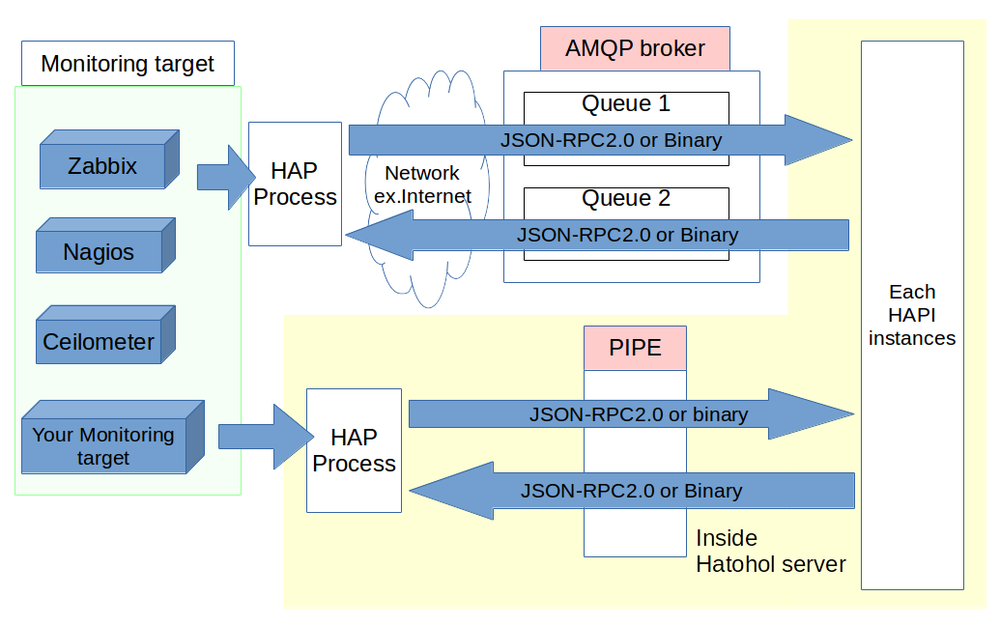

# Hatohol Arm Plugin Interface 2.0 仕様書(2015/04/16)

## ToDO

serverTypeのURL

## 概要

Hatohol Arm Plugin Interface (HAPI) 2.0 は，Hatoholサーバーと監視サーバープラグイン間の情報交換のためのプロトコルです。
両者の間に確立された通信路上で実装されるJSON-RPCのアプリケーションとして構築されます。



## 用語

|用語|説明|
|:---|:---|
|SRV|Hatoholサーバー|
|HAP|Hatohol監視サーバープラグイン|

"MUST", "MUST NOT", "REQUIRED", "SHALL", "SHALL NOT", "SHOULD", "SHOULD NOT", "RECOMMENDED", "MAY" および "OPTIONAL" は，[RFC2119](http://www.ietf.org/rfc/rfc2119.txt)に従います。

## 関連プロトコル

### 通信路

通信路として，Advanced Message Queuing Protocol (AMQP) 0.9.1を用います。
- AMQP 0.9.1: https://www.rabbitmq.com/resources/specs/amqp0-9-1.pdf

### JSON-RPC

情報交換の基本プロトコルとして，JSON-RPC 2.0を用います。
- [JSON-RPC 2.0 (2013-01-04)](http://www.jsonrpc.org/specification)
- [JSON(RFC4627)](https://www.ietf.org/rfc/rfc4627.txt)

#### 注意事項
- リクエスト・レスポンスで使用するIDオブジェクトの値には，十分なランダム性が必要です(SHOULD)。
- HAPI2.0では，JSON-RPCのバッチリクエストを使用してはなりません(MUST NOT)。
- 特記しない限り，number型オブジェクトの値範囲は0~2147483647です。

## 動作概要

以下のシーケンス図は，HatoholサーバーとHAP間で送受信される各プロシージャのリクエスト・レスポンスの想定される標準的な動作を表す一例です。。

```

Hatoholサーバー                                   HAP
    |                                               
    |                                        Turn on HAP
    |                                              |
    |<----------exchangeProfile(リクエスト)------->|
    |<----------exchangeProfile(レスポンス)------->|
    |                                          |   |
    |                               ポーリング間隔 |
    |                                          |   |
    |<-----getMonitoringServerInfo(リクエスト)-----|
    |------getMonitoringServerInfo(レスポンス)---->|
    |                                              |
    |<-----------getLastInfo(リクエスト)-----------|
    |------------getLastInfo(レスポンス)---------->|
    |<-----------updateHosts(リクエスト)-----------|
    |------------updateHosts(レスポンス)---------->|
    |                                              |
    |<-----------getLastInfo(リクエスト)-----------|
    |------------getLastInfo(レスポンス)---------->|
    |<--------updateHostGroups(リクエスト)---------|
    |---------updateHostGroups(レスポンス)-------->|
    |                                              |
    |<-----------getLastInfo(リクエスト)-----------|
    |------------getLastInfo(レスポンス)---------->|
    |<----updateHostGroupMembership(リクエスト)----|
    |-----updateHostGroupMembership(レスポンス)--->|
    |                                              |
    |<-----------getLastInfo(リクエスト)-----------|
    |------------getLastInfo(レスポンス)---------->|
    |<-----------updateTriggers(リクエスト)--------|
    |------------updateTriggers(レスポンス)------->|
    |                                              |
    |<-----------getLastInfo(リクエスト)-----------|
    |------------getLastInfo(レスポンス)---------->|
    |<-----------updateEvents(リクエスト)----------|
    |------------updateEvents(レスポンス)--------->|
    |                                              |
    |<-----------getLastInfo(リクエスト)-----------|
    |------------getLastInfo(レスポンス)---------->|
    |<-----------updateHostParent(リクエスト)------|
    |------------updateHostParent(レスポンス)----->|
    |                                              |
    |<-----------updateArmInfo(リクエスト)---------|
    |------------updateArmInfo(レスポンス)-------->|
    |                                          |   |
    |                               ポーリング間隔 |
    |                                          |   |
 ~~~~~~~~~~~~~~~~~~~~~~~~~~~~~~~~~~~~~~~~~~~~~~~~~~~~~~~
 ~~~~~~~~~~~~~~~~~~~~~~~~~~~~~~~~~~~~~~~~~~~~~~~~~~~~~~~
    |                                              |
    |-----------fetchItems(リクエスト)------------>|
    |<----------fetchItems(レスポンス)-------------|
    |<----------updateItems(リクエスト)------------|
    |-----------updateItems(レスポンス)----------->|
    |                                              |
    |-----------fetchHistory(リクエスト)---------->|
    |<----------fetchHistory(レスポンス)-----------|
    |<-----sendHistory(ノーティフィケイション)-----|
    |                                              |
    |-----------fetchTriggers(リクエスト)--------->|
    |<----------fetchTriggers(レスポンス)----------|
    |<---------updateTriggers(リクエスト)----------|
    |"ALL"オプションを使用し全てのトリガーを送信する|
    |----------updateTriggers(レスポンス)--------->|
    |                                              |
    |-------------fetchEvents(リクエスト)--------->|
    |<------------fetchEvents(レスポンス)----------|
    |<-----------updateEvents(リクエスト)----------|
    |------------updateEvents(レスポンス)--------->|
    |                                              |

```
## データ型

 - JSON-RPCではなくHatoholが独自に定義しているデータ型について解説します。これらは内部的にはJSON-RPCが定義しているデータ型を使用しています。

|名前|JSON型|解説|
|:---|:---------|:---|
|timestamp|string|この型は時刻を格納します。フォーマットはYYYYMMDDhhss.nnnnnnnnnです。YYYY,MM,DD,hh,ss, および,nnnnnnnnnは，それぞれ，西暦，月，日，時，分，秒，および，ナノ秒を表します。小数点以下の時刻については省略できます。また，小数点以下には9桁までしか値を挿入できません。小数点以下を省略した場合，または小数点以下が9桁未満の場合には余った桁部に0が挿入されます。(Ex.100 -> 100.000000000, 100.1234 -> 100.123400000)|
|boolean|true, false|この型は真偽値を格納します。true or falseを指定し，その値の真偽を示します|

## 起動時の動作について

 - HAPやHatoholサーバーの起動，または再起動直後に自身と接続相手が使用可能なプロシージャの一覧をexchangeProfileプロシージャを用いて交換します。この情報を基に，互いが使用するプロシージャの最適化を行うことができます。

## プロシージャ

### Hatoholサーバーに実装するプロシージャ

|プロシージャ名|解説|タイプ|M/O|
|:-------------|:---|:-----|:-:|
|[exchangeProfile](#user-content-exchangeprofile)|自身が実装しているプロシージャ一覧と自身のプロセス名をHAPに送信します<br>また，そのレスポンスとしてHAPが実装しているプロシージャ一覧とHAPのプロセス名を取得します|method|M|
|[getMonitoringServerInfo](#user-content-getmonitoringserversnfo)|getMonitorinServerInfo接続情報やポーリング間隔等をHatoholサーバーから取得します|method|M|
|[getLastInfo](#user-content-getlastinfo)|指定した要素の最新情報をHatoholサーバーから取得します|method|M
|[updateItems](#user-content-updateitems)|監視しているアイテム一覧をHatoholサーバーに送信します|method|O|
|[sendHistory](#user-content-sendhistory)|各アイテムが所持しているヒストリーをHatoholサーバーに送信します|notification|O|
|[updateHosts](#user-content-updatehosts)|監視しているホスト一覧をHatoholサーバーに送信します|method|O|
|[updateHostGroups](#user-content-updatehostgroups)|ホストグループの情報をHatoholサーバーに送信します|method|O|
|[updateHostGroupMembership](#user-content-updatehostgroupmembership)|ホストのホストグループ所属情報をHatoholサーバーに送信します|method|O|
|[updateTriggers](#user-content-updatetrigges)|監視しているトリガーをHatoholサーバーに送信します|method|O|
|[updateEvents](#user-content-updateevents)|アップデートされたイベントをHatoholサーバーに送信します|method|O|
|[updateHostParent](#user-content-updatehostparent)|ホスト同士のVM親子関係をHatoholサーバーに送信します|method|O|
|[updateArmInfo](#user-content-updatearminfo)|HAPの接続ステータスをHatoholサーバーに送信します|method|M|

### HAPに実装するプロシージャ

|プロシージャ名|解説|タイプ|M/O|
|:-------------|:---|:-----|:-:|
|[exchangeProfile](#user-content-exchangeprofile)|自身が実装しているプロシージャ一覧と自身のプロセス名をHatoholサーバーに送信します<br>また，そのレスポンスとしてHatoholサーバーが実装しているプロシージャ一覧とHatoholサーバーのプロセス名を取得します|method|M|
|[fetchItems](#user-content-fetchitems)|Hatoholサーバーがアイテムを要求しているときにHAPに送信されます|method|O|
|[fetchHistory](#user-content-fetchhistory)|Hatoholサーバーがヒストリーを要求しているときにHAPに送信されます|method|O|
|[fetchTriggers](#user-content-fetchtriggers)|Hatoholサーバーが全てのトリガーを要求しているときにHAPに送信されます|method|O|
|[fetchEvents](#user-content-fetchevents)|HatoholサーバーがHatoholDBに登録されている最古イベント以前のイベントを要求しているときにHAPに送信されます|method|O|

 - 「M/O」はそのプロシージャがMandatory(必須)かOptional(任意)であるかを表します。Mandatoryであるプロシージャは実装を省略できません。
 - update~~~プロシージャは，送信したデータのデータベース書き込み成否をresultオブジェクトで受け取ります。受け取る値については[[一覧](#user-content-updateresult)]をご覧ください。
 - fetch~~~プロシージャで受けたリクエスト受け入れの成否をresultオブジェクトとしてHatoholサーバーに返す必要があります。返す値については[[一覧](#user-content-fetchresult)]をご覧ください。

### exchangeProfile(method)

 - Hatoholサーバー，HAP両者に共通するプロシージャです。主に初期起動時，再起動時に使用することを標準的な動作とします。詳細については[起動時の動作について](#user-content-起動時の動作について)をご覧ください。

***リクエスト(params)***

|オブジェクトの名前|型 |M/O|デフォルト値|値の範囲|解説|
|:---|:--|:-------:|:----------:|:------:|:---|
|procedures|string配列|M|-|-|送信元が使用可能なプロシージャ一覧|
|name |string|M|-|-|送信元の名前です。接続完了の旨を伝えるログなどに利用されます|

```
{"jsonrpc":"2.0", "method":"exchangeProfile", "params":{"procedures":["getMonitoringServerInfo", "getLastInfo", "updateItems", "updateArmInfo", "fetchItems"], "AgentName":"exampleName"} "id":1}
```

***リザルト(result)***

|オブジェクトの名前|型 |M/O|デフォルト値|値の範囲|解説|
|:---|:--|:-------:|:----------:|:------:|:---|
|procedures|string配列|M|-|-|送信先が使用可能なプロシージャ一覧|
|name |string|M|-|-|送信先のプロセス名です。接続完了の旨を伝えるログなどに利用されます|

```
{"jsonrpc":"2.0", "result":{"procedures":["getMonitoringServerInfo", "getLastInfo", "updateItems", "updateArmInfo", "fetchItems"],"name":"exampleName"} "id":1}
```

### getMonitoringServerInfo(method)

 - ポーリング時間毎にHatoholサーバーに自身の接続情報やポーリング間隔等を問い合わせることを標準的な動作としますが，任意のタイミングで問い合わせることもできます。

***リクエスト(params)***

 - getMonitoringServerInfoメソッドには引数が存在しません。paramsオブジェクトの値をnullにしてリクエストを送信してください。

```
{"jsonrpc":"2.0", "method":"getMonitoringServerInfo", "params":null, "id":1}
```

***リザルト(result)***

|オブジェクトの名前|型|M/O|デフォルト値|値の範囲|解説|
|:---|:--|:----------:|:---------:|:------:|:---|
|serverId          |number|M|-|正の整数|監視サーバーのサーバーID|
|url               |string|M|-|-|監視サーバーのURL [[解説](#user-content-servertype)]|
|type              |string|M|-|-|監視サーバーの種類 [[一覧](#user-content-servertype)]|
|nickName          |string|M|-|255文字以内|監視サーバーのニックネーム|
|userName          |string|M|-|255文字以内|監視サーバーのユーザーネーム|
|password          |string|M|-|255文字以内|監視サーバーのパスワード|
|dbName            |string|M|-|255文字以内|監視サーバ監視サーバーのデータベースのパスワード|
|pollingIntervalSec|number|M|-|正の整数|ポーリングを行う間隔|
|retryIntervalSec  |number|M|-|正の整数|ポーリングが失敗した場合，リトライを行うまでの間隔|
|extra             |string|M|-|32767文字以内|プラグイン固有の情報を格納することができる|

```
{"jsonrpc":"2.0", "result":{"hostName":"exampleHost", "type":0, "ipAddress":"127.0.0.1", "nickName":"exampleName", "userName":"Admin", "password":"examplePass", "dbName":"", "port":80, "pollingIntervalSec":30, "retryIntervalSec":10, "extra":"exampleExtraInfo"}, "id":1}
```

### getLastInfo(method)

 - プロシージャ名にupdateが付いているプロシージャの呼び出し時にHatoholサーバーに送信，保存されたlastInfo情報を要求します。取得したlastInfoを用いて，前回までに送信したデータと現在所持しているデータの差分をHatoholサーバーに送信できます。
 - 初回起動時など，HatoholサーバーにlastInfoが保存されていない場合，resultオブジェクトの値はnullとして返ってきます。

***リクエスト(params)***

 - どの種類のlastInfoが必要かを指定する必要があります。以下の表は指定できる値の一覧です。

|paramsオブジェクトの値一覧(string)|解説|
|:---------|:---|
|"host"|ホストの最新情報を指定します。|
|"hostGroup"|ホストグループの最新情報を指定します。|
|"hostGroupMembership"|ホストグループの所属情報の最新情報を指定します。|
|"trigger"|トリガーの最新情報を指定します。|
|"event"|イベントの最新情報を指定します。|
|"hostParent"|ホストのVM親子関係の最新情報を指定します。|

```
{"jsonrpc":"2.0", "method":"getLastInfo", "params":"trigger", "id":1}
```

***リザルト(result)***

|resultオブジェクトの値|型 |M/O|デフォルト値|値の範囲|解説|
|:---------------------|:--|:-:|:----------:|:------:|:---|
|最新情報|string|M|-|255文字以内|Hatoholサーバーに保存されている指定した要素の最新情報|

```
{"jsonrpc":"2.0", "result":"201504011349", "id":1}

この例ではlastInfoとしてタイムスタンプが返ってきています
```

### updateItems(method)

 - Hatoholサーバーとの接続完了時，または[fetchItems](#user-content-fetchitems)プロシージャのリクエストをHatoholサーバーから受け取った時に全てのアイテム情報を送信することを標準動作とします。Hatoholサーバーの負荷が高くなることが危惧されるため，任意のタイミングで使用することはできません。

***リクエスト(params)***

|オブジェクトの名前|型 |M/O|デフォルト値|値の範囲|解説|
|:---|:--|:--|:-----------|:-------|:--|
|items|object|M|-|-|アイテム情報を格納するオブジェクトを配置します。詳細は次のテーブルを確認してください|
|fetchId|string|M|-|-|Hatoholサーバーから送られたどのfetchItemsプロシージャによるリクエストに対するレスポンスであるかを示すIDです。fetchItemsプロシージャのparams内のfetchIdオブジェクトの値をここに入れてください。|

***itemsオブジェクト***

|オブジェクトの名前|型|M/O|デフォルト値|値の範囲|解説|
|:---|:--|:----------:|:---------:|:------:|:---|
|itemId       |string|M|-|65535byte以内|アイテムのID|
|hostId       |string|M|-|65535byte以内|アイテムが所属するホストのID|
|brief        |string|M|-|65535byte以内|アイテムの概要|
|lastValueTime|timestamp|M|-|65535byte以内|アイテムが最後に更新された時刻|
|lastValue    |string|M|-|65535byte以内|アイテムが最後に更新された際の値|
|prevValue    |string|M|-|65535byte以内|アイテムが最後に更新される前の値|
|itemGroupName|string|M|-|65535byte以内|アイテムをグループ分けしたもの<br>任意のグループ名をご使用ください|
|unit         |string|M|-|65535byte以内|valueの単位|

```
{"jsonrpc":"2.0","method":"updateItems", "params":{"items":[{"itemId":"1", "hostId":"1", "brief":"example brief", "lastValueTime":"201504101755", "lastValue":"example value", "prevValue":"example previous value", "itemGroupName":"example name", "unit":"example unit"}, {"itemId":"2", "hostId":"1", "brief":"example brief", "lastValueTime":"201504101755", "lastValue":"example value", "prevValue":"example previous value", "itemGroupName":"example name", "unit":"example unit"}], "fetchId":"1"}, "id":1}
```

***リザルト(result)***

```
{"jsonrpc":"2.0", "result":"SUCCESS", "id":1}
```

### sendHistory(notification)

 - [fetchHistory](#user-content-fetchhistory)プロシージャをHatoholサーバーから受け取った際に，条件にマッチするヒストリーをHatoholサーバーに送信します。Hatoholサーバーの負荷が高くなることが危惧されるため，任意のタイミングで使用することはできません。

***リクエスト(params)***

|オブジェクトの名前|型 |M/O|デフォルト値|値の範囲|解説|
|:---|:--|:--|:-----------|:-------|:--|
|アイテムID|object配列|M|-|-|ヒストリー情報を格納するオブジェクトを配置します。詳細は次のテーブルを確認してください|
|fetchId|string|M|-|-|Hatoholサーバーから送られたどのリクエストに対するレスポンスであるかを示すIDです。fetchHistoryのparams内のfetchIdオブジェクトの値をここに入れてください|

|オブジェクトの名前|型 |M/O|デフォルト値|値の範囲|解説|
|:---|:--|:-------:|:----------:|:------:|:---|
|value |string|M|-|65535byte以内|clock時点でのアイテムの値|
|clock |timestamp|M|-|65535byte以内|このヒストリーの値が記録された時刻|

```
{"jsonrpc":"2.0", "method":"sendHistory", "params":{"1":[{"value":"exampleValue","clock":"201503231130"},{"value":"exampleValue2","clock":"201503231130"}], "fetchId":"1"}, "id":1}
```

### updateHosts(method)

 - Hatoholサーバーとの接続完了時，またはHAPが内部的に保存している登録ホスト情報が変更された際は,"ALL"オプションを用いて全てのホスト情報をHatoholサーバーに送信します。
 - "UPDATE"オプションを用いた場合は[getLastInfo](#user-content-getlastinfo)プロシージャ，またはHAP自身から呼び出したlastInfoを基に，その時点から現時点までに追加されたホストをHatoholサーバーに送信します。

***リクエスト(params)***

|オブジェクトの名前|型|M/O|デフォルト値|値の範囲|解説|
|:--|:--|:--|:--|:--|:--|
|hosts|object配列|M|-|-|ホスト情報を格納するオブジェクトを配置します。詳細は次のテーブルを確認してください|
|updateOption|string|M|-|-|送信オプション[[一覧](#user-content-updateoption)]の中から状況に応じた送信オプションを選択してください|
|lastInfo|string|O|-|65535byte以内|最後に送信したホストの情報を送信する。この情報が[getLastInfo](#user-content-getlastinfo)の返り値になる|

***hostsオブジェクト***

|オブジェクトの値|型 |M/O|デフォルト値|値の範囲|解説|
|:--|:--|:--|:----------:|:------:|:---|
|hostId  |string|M|-|65535byte以内|監視サーバーが監視しているホストID|
|hostName|string|M|-|65535byte以内|監視サーバーが監視しているホスト名|

```
{"jsonrpc":"2.0","method":"updateHosts", "params":{"hosts":[{"hostId":"1", "hostName""exampleHostName1"}], "updateOption":"UPDATE","lastInfo":"201504091052"}, "id":1}
```

***リザルト(result)***

```
{"jsonrpc":"2.0", "result":"SUCCESS", "id":1}
```

### updateHostGroups(method)

 - Hatoholサーバーとの接続完了時，またはHAPが内部的に保存している登録ホスト情報が変更された際は"ALL"オプションを用い，全てのホストグループ情報をHatoholサーバーに送信します。
 - "UPDATE"オプションを用いた場合は[getLastInfo](#user-content-getlastinfo)プロシージャ，またはHAP自身から呼び出したlastInfoを基に，その時点から現時点までに追加されたホストグループをHatoholサーバーに送信します。

***リクエスト(params)***

|オブジェクトの名前|型|M/O|デフォルト値|値の範囲|解説|
|:--|:--|:--|:--|:--|:--|
|hostGroups|object配列|M|-|-|ホストグループ情報を格納するオブジェクトを配置します。詳細は次のテーブルを確認してください|
|updateOption|string|M|-|-|送信オプション[[一覧](#user-content-updateoption)]の中から状況に応じた送信オプションを選択してください|
|lastInfo|string|O|-|65535byte以内|最後に送信したホストグループの情報を送信する。この情報が[getLastInfo](#user-content-getlastinfo)の返り値になる|

***hostGroupsオブジェクト***

|オブジェクトの値|型 |M/O|デフォルト値|値の範囲|解説|
|:---|:--|:-------:|:----------:|:------:|:---|
|groupId|string|M|-|65535byte以内|ホストグループのID|
|groupName|string|M|-|65535byte以内|グループIDに対応したホストグループの名前|

```
{"jsonrpc":"2.0","method":"updateHostGroups", "params":{"hostGroups":[{"groupId":"1", "groupName":"Group2"}],"updateOption":"ALL", "lastInfo":"201504091049"}, "id":1}
```

***リザルト(result)***

```
{"jsonrpc":"2.0", "result":"SUCCESS", "id":1}
```

### updateHostGroupMembership(method)

 - Hatoholサーバーとの接続完了時，またはHAPが内部的に保存している登録ホスト情報が変更された際は"ALL"オプションを用い，全てのホストグループ所属情報をHatoholサーバーに送信します。
 - "UPDATE"オプションを用いた場合は[getLastInfo](#user-content-getlastinfo)プロシージャ，またはHAP自身から呼び出したlastInfoを基に，その時点から現時点までに追加されたホストグループ所属情報をHatoholサーバーに送信します。

***リクエスト(params)***

|オブジェクトの名前|型|M/O|デフォルト値|値の範囲|解説|
|:--|:--|:--|:--|:--|:--|
|hostGroupMembership|object配列|M|-|-|ホストグループ所属情報を格納するオブジェクトを配置します。詳細は次のテーブルを確認してください|
|updateOption|string|M|-|-|送信オプション[[一覧](#user-content-updateoption)]の中から状況に応じた送信オプションを選択してください|
|lastInfo|string|O|-|65535byte以内|最後に送信したホストグループ所属情報の情報を送信する。この情報が[getLastInfo](#user-content-getlastinfo)の返り値になる|

***hostGroupMembershipオブジェクト***

|オブジェクトの値|型 |M/O|デフォルト値|値の範囲|解説|
|:---|:--|:-------:|:----------:|:------:|:---|
|hostId |string|M|-|65535byte以内|ホストのID|
|groupIds|string配列|M|-|65535byte以内|ホストグループのID|
```
{"jsonrpc":"2.0","method":"updateHostGroupMembership", "params":{"hostGroupsMembership":[{"hostId":"1", "groupIds":["1", "2", "5"]}], "lastInfo":"201504091056", "updateOption":"ALL"}, "id":1}
```

***リザルト(result)***

```
{"jsonrpc":"2.0", "result":"SUCCESS", "id":1}
```

### updateTriggers(method)

[getLastInfo](#user-content-getlastinfo)を用いて取得，またはHAP自身が保管している最新トリガー情報を基に，そのトリガーから現時点までに更新されたトリガーをHatoholサーバーに送信するか，全てのトリガーを送信します。
 - Hatoholサーバーとの接続完了時，fetchTriggersプロシージャによる要求があった際は"ALL"オプションを用い，全てのトリガーをHatoholサーバーに送信します。
 - "UPDATE"オプションを用いた場合は[getLastInfo](#user-content-getlastinfo)プロシージャ，またはHAP自身から呼び出したlastInfoを基に，その時点から現時点までに更新，追加されたトリガーをHatoholサーバーに送信します。

***リクエスト(params)***

名前：triggers, lastInfo, updateOption, fetchId

各オブジェクトの値：

|名前|型|M/O|デフォルト値|値の範囲|解説|
|:--|:--|:--|:--|:--|:--|
|triggers|object配列|M|-|-|トリガー情報を格納するオブジェクトを配置します。詳細は次のテーブルを確認してください|
|updateOption|string|M|-|-|送信オプション[[一覧](#user-content-updateoption)]の中から状況に応じた送信オプションを選択してください|
|lastInfo|string|O|-|65535byte以内|最新トリガーの情報を送信する。この情報が[getLastInfo](#user-content-getlastinfo)の返り値になる|
|fetchId|string|O|-|-|Hatoholサーバーから送られたどのリクエストに対するレスポンスであるかを示すIDです。fetchTriggersのparams内のfetchIdオブジェクトの値をここに入れてください|

***triggersオブジェクト***

HAP自身のトリガーを送信する場合は，トリガーIDとホストIDを"_SELF_"と記述することで送信したトリガーをSELFトリガー扱いにできます。SELFトリガーはHAPがHAPをプロセス自身を監視し，異常が起きていないかどうかを検知します。

|名前|型 |M/O|デフォルト値|値の範囲|解説|
|:---|:--|:-------:|:----------:|:------:|:---|
|triggerId     |string|M|-|正の整数     |トリガーのID|
|status        |string|M|-|-            |トリガーのステータス [[一覧](#user-content-triggerstatus)]|
|severity      |string|M|-|-            |トリガーの種別 [[一覧](#user-content-triggerseverity)]|
|lastChangeTime|string|M|-|65535byte以内|トリガーが最後に更新された時刻|
|hostId        |string|M|-|正の整数     |トリガーが所属するホストID|
|hostName      |string|M|-|65535byte以内|トリガーが所属するサーバーのホスト名|
|brief         |string|M|-|65535byte以内|トリガーの概要|
|extendedInfo  |string|M|-|65535byte以内|上記の情報以外の必要な情報。主にWebUI上にデータを表示する際に用いられる|

```
{"jsonrpc":"2.0", "method":"updateTriggers", "params":{"updateOption":"UPDATED", "lastInfo":"201504061606", "fetchId":"1", "triggers":[{"triggerId":"1", "status":"OK", "severity":"INFO","lastChangeTime":"201503231758", "hostId":"1", "hostName":"exampleName", "brief":"example brief", "extendedInfo": "sample extended info"}]},"id":1}
```

***リザルト(result)***

```
{"jsonrpc":"2.0", "result":"SUCCESS", "id":1}
```

### updateEvents(method)

 - 一度に送信できるイベント数は1000件までです。1000件を越える場合は，複数回に分けて送信してください。
 - イベントIDが重複したイベントを送信することは認めてられてします。しかし，元から存在するイベントと送信するイベントのどちらが優先されるかは未定義です。
 - 自発的にイベントを送信する動作とfetchEventsプロシージャに対するレスポンスとしてイベントを送信する動作の2つの動作が存在します。
 - 自発的にイベントを送信する場合は，まず[getLastInfo](#user-content-getlastinfo)のレスポンスや，HAP自身からlastInfoを取得します。取得したlastInfoで判別したイベントから現時点までに発生した差分のイベントをHatoholサーバーに送信します。初回通信時は，lastInfoの値がnullであるため，接続以前に発生したイベントをすべて送信するか，何も送信しない選択がHAP作成者に委ねられています。
 - fetchEventsプロシージャのlastInfoで指定されたイベントより先にイベントが存在しない場合は，eventsオブジェクトの値を空配列にして送信してください。

***リクエスト(params)***

|オブジェクトの名前|型|M/O|デフォルト値|値の範囲|解説|
|:--|:--|:--|:--|:--|:--|
|events|object配列|M|-|-|イベント情報を格納するオブジェクトを配置します。詳細は次のテーブルを確認してください。|
|lastInfo|string|O|-|65535byte以内|イベントを送信する際，次回イベントを送信する際の基準となる情報を送信する。この情報が[getLastInfo](#user-content-getlastinfo)の返り値になる。しかし，mayMoreFlagの値がtrueとなっている場合，この値はHatoholのDBへは保存されずHatoholサーバープロセスに一時的に保存される|
|mayMoreFlag|boolean|M|-|-|fetchEventsプロシージャで指定された件数に満たない件数のイベントを送信し，送信すべきイベントがまだ残っている可能性がある場合に値をtrueとしてください。この値をtrueにする場合，最低限イベントを1件は送信する必要があります|
|fetchId|string|O|-|-|このオブジェクトはfetchEventsによるリクエストを受けた場合のみ記述する必要があります。Hatoholサーバーから送られたどのリクエストに対するレスポンスであるかを示すIDです。fetchEventsのparams内のfetchIdオブジェクトの値をここに入れてください|

***eventsオブジェクト***

|名前|型 |M/O|デフォルト値|値の範囲|解説|
|:---|:--|:-------:|:----------:|:------:|:---|
|eventId     |string|M|-|65535byte以内|イベントのID|
|time        |timestamp|M|-|65535byte以内|イベントが発生した時刻|
|type        |string|M|-|-|イベントのタイプ [[一覧](#user-content-eventtype)]|
|triggerId   |number|O|-|正の整数     |このイベントを発火させたトリガーID。トリガーとイベントを関連付けないことも可能なため，必須ではありません|
|status      |string|M|-|-|トリガーのステータス [[一覧](#user-content-triggerstatus)]|
|severity    |string|M|-|-|トリガーの種別 [[一覧](#user-content-triggerseverity)]|
|hostId      |string|M|-|65535byte以内|イベントが発生したホストのID|
|hostName    |string|M|-|65535byte以内|イベントが発生したホストの名前|
|brief       |string|M|-|65535byte以内|イベントの説明。Web上に表示される情報|
|extendedInfo|string|M|-|65535byte以内|briefには書いていない追加の情報を記述できます|

```
{"jsonrpc":"2.0", "method":"updateEvents", "params":{"events":[{"eventId":"1", "time":"201503231513", "type":"GOOD", "triggerId":2, "status": "OK","severity":"INFO":, "hostId":3, "hostName":"exampleName", "brief":"example brief", "extendedInfo": "sampel extended info"}], "lastInfo":"201504011759", "fetchId":"1"},"id":1}
```

***リザルト(result)***

```
{"jsonrpc":"2.0", "result":"SUCCESS", "id":1}
```

### updateHostParent(method)

 - Hatoholサーバーとの接続完了時は"ALL"オプションを用い，全てのVM親子関係をHatoholサーバーに送信します。
 - "UPDATE"オプションを用いた場合は[getLastInfo](#user-content-getlastinfo)プロシージャ，またはHAP自身から呼び出したlastInfoを基に，その時点から現時点までに追加されたVM親子関係をHatoholサーバーに送信します。

***リクエスト(params)***

|名前|型|M/O|デフォルト値|値の範囲|解説|
|:--|:--|:--|:--|:--|:--|
|hostParent|object配列|M|-|-|VMの親子関係を格納するオブジェクトを配置します。詳細は次のテーブルを確認してください|
|updateOption|string|M|-|-|送信オプション[[一覧](#user-content-updateoption)]の中から状況に応じた送信オプションを選択してください|
|lastInfo|string|O|-|65535byte以内|最後に送信したホストグループ所属情報の情報を送信する。この情報が[getLastInfo](#user-content-getlastinfo)の返り値になる|

***hostParentオブジェクト***

 - VMの親子関係を削除する場合は親ホストIDの値をnullにすることで，送信した子ホストIDの親子関係をHatoholサーバーから削除することができます。

|オブジェクトの名前|型 |M/O|デフォルト値|値の範囲|解説|
|:---|:--|:-------:|:----------:|:------:|:---|
|childHostId |string|M|-|65535byte以内|VMの子ホストのID|
|parentHostId|string or null|M|-|65535byte以内|VMの親ホストのID|

```
{"jsonrpc":"2.0", "method":"updateHostParent", "params":{[{"childHostId":"12","parentHostId":"10"}], "updateOption":"ALL", "lastInfo":"201504152246"} "id":1}
```

***リザルト(result)***

```
{"jsonrpc":"2.0", "result":"SUCCESS", "id":1}
```

### updateArmInfo(method)

HostやTrigger，Event情報の送信処理が行われるたびにHatoholサーバーに送信することを標準的な動作としますが，任意に送信してもかまいません。最小間隔は１秒（MUST），最大間隔は[getMonitoringServerInfo](#user-content-getmonitoringserverinfo)で取得したポーリング時間の2倍（SHOULD）とします。

***リクエスト(params)***

|オブジェクトの名前|型|M/O|デフォルト値|値の範囲|解説|
|:---|:--|:---------:|:----------:|:------:|:---|
|lastStatus         |string   |M|-|-|最新のポーリング結果 [[一覧](#user-content-arminfostatus)]|
|failureReason      |string   |M|-|65535byte以内|情報取得が失敗した理由|
|lastSuccessTime    |timestamp|M|-|-|最後に情報取得が成功した時刻|
|lastFailureTime    |timestamp|M|-|-|最後に情報取得が失敗した時刻|
|numSuccess         |number   |M|-|正の整数|HAPが起動してから情報取得に成功した回数|
|numFailure         |number   |M|-|正の整数|HAPが起動してから情報取得に失敗した回数|

```
{"jsonrpc":"2.0", "method":"updateArmInfo", "params":{"lastStatus":"INIT", "failureReason":"Example reason", "lastSuccessTime":"201503131611", "lastFailureTime":"201503131615", "numSuccess":165, "numFailure":10}, "id":1}
```

***リザルト(result)***

```
{"jsonrpc":"2.0", "result":"SUCCESS", "id":1}
```

### fetchItems(method)

Hatoholサーバーがアイテムを要求しているときにHAPに送信されます。このプロシージャを受け取った時，resultとしてリクエスト受け入れの成否を返す必要があります。その後，全てのアイテムをupdateItemsプロシージャ[updateItems](#user-content-updateitems)を用いてHatoholサーバーに送信してください。その際，paramsのfetchIdオブジェクトの値を[updateItems](#user-contents-updateitems)に渡す必要があります。

***リクエスト(params)***

|オブジェクトの名前|型 |M/O|デフォルト値|値の範囲|解説|
|:---|:--|:-------:|:----------:|:------:|:---|
|selectHosts|string配列|M|-|-|指定したホストのアイテムのみを取得することできます。この値を”ALL”とすると全てのホストのアイテムを取得します。|
|fetchId|string|M|-|255文字以内|updateItemsプロシージャで使用します。そのupdateItemsプロシージャがどのfetchItemsプロシージャによる要求に対応したものかをHatoholサーバーが識別するために必要です|

```
{"jsonrpc":"2.0", "method":"fetchItems", "params":{"selectHosts":["1", "2", "3"], "fetchId":"1"}, "id":1}
```

***リザルト(result)***

```
{"jsonrpc":"2.0", "result":"SUCCESS", "id":1}
```

### fetchHistory(method)

 - このプロシージャは，Hatoholサーバーがヒストリーを要求しているときにHAPに送信されます。HAPはレスポンスとしてリクエスト受け入れの成否を返す必要があります。その後，指定条件に当てはまるヒストリーをupdateHistoryプロシージャ[updateHistory](#user-content-sendhistory)を用いてHatoholサーバーに送信してください。その際，fetchHistoryプロシージャのparams内にあるfetchIdの値をsendHistoryプロシージャに渡す必要があります。
 - reqオブジェクト内にあるbeginTime，endTimeはbeginTime以上，endTime以下の条件に当てはまるHistory取得することを想定しています。

***リクエスト(params)***

|オブジェクトの名前|型 |M/O|デフォルト値|値の範囲|解説|
|:---|:--|:--|:-----------|:-------|:--|
|reqHistory|object|M|-|-|ヒストリーを取得するために必要な情報です。詳細は次のテーブルを確認してください|
|fetchId|string|M|-|255文字以内|sendHistoryプロシージャで使用します。そのsendHistoryプロシージャがどのfetchHistoryプロシージャによる要求に対応したものかをHatoholサーバーが識別するために必要です|

***reqHistoryオブジェクト***

|オブジェクトの名前|型 |M/O|デフォルト値|値の範囲|解説|
|:---|:--|:-------:|:----------:|:------:|:---|
|hostId   |string|M|-|255文字以内|ヒストリーのアイテムが所属しているホストID|
|itemId   |number|M|-|正の整数   |ヒストリーのアイテムID|
|beginTime|string|M|-|255文字以内|ヒストリー取得域の始点時刻を指定します|
|endTime  |string|M|-|255文字以内|ヒストリー取得域の終点時刻を指定します|

```
{"jsonrpc":"2.0", "method":"fetchHistory", "params":{"reqHistory":{"hostId":"1", "itemId":1, "valueType":"INTERGER", "beginTime":"201503231513", "beginTime":"201503231513"}, "fetchId":1 },"id":1}
```

***リザルト(result)***

```
{"jsonrpc":"2.0", "result":"SUCCESS", "id":1}
```

### fetchTriggers(method)

 - このプロシージャは，Hatoholサーバーが全てのトリガーを要求しているときにHAPに送信されます。HAPはレスポンスとしてリクエスト受け入れの成否を返す必要があります。その後，[updateTriggersプロシージャ](#user-content-updatetriggers)の"ALL"オプションを用いて監視している全てのトリガーを送信してください。その際，fetchTriggersプロシージャのparams内にあるfetchIdの値をupdateTriggersプロシージャに渡す必要があります。

***リクエスト(params)***

|オブジェクトの名前|型 |M/O|デフォルト値|値の範囲|解説|
|:---|:--|:-------:|:----------:|:------:|:---|
|fetchId|string|M|-|255文字以内|updateTriggersプロシージャで使用します。そのupdateTriggersプロシージャがどのfetchTriggersプロシージャによる要求に対応したものかをHatoholサーバーが識別するために必要です|

```
{"jsonrpc":"2.0", "method":"fetchTriggers", "params":{"fetchId":"1"}, "id":1}
```

***リザルト(result)***

```
{"jsonrpc":"2.0", "result":"SUCCESS", "id":1}
```

### fetchEvents(method)

 - 指定したイベントIDから昇順，または降順で指定した件数のイベントを取得するリクエストが送信されます。HAPはレスポンスとしてリクエスト受け入れの成否を返す必要があります。その後，指定された条件のイベントを[updateEventsプロシージャ](#user-content-updateevents)を用いて送信してください。その際，fetchEventsプロシージャのparamsオブジェクト内にあるfetchIdの値をupdateEventsプロシージャに渡す必要があります。
 - 指定できる取得件数は一度のリクエストで1000件までです。それ以上の件数を取得したい場合は複数回のリクエストに分けて取得してください。

***リクエスト(params)***

|オブジェクトの名前|型 |M/O|デフォルト値|値の範囲|解説|
|:---|:--|:-------:|:----------:|:------:|:---|
|lastInfo|string|M|-|255文字以内|基準となるイベントの情報です|
|count     |number|M|-|正の整数|取得するイベント件数|
|direction        |string|M|-|-|"ASC"（指定したIDより新しいイベント）または”DESC”(指定したIDより古いイベント)を選択します|
|fetchId|string|M|-|255文字以内|updateEventsプロシージャで使用します。そのupdateEventsプロシージャがどのfetchEventsプロシージャによる要求に対応したものかをHatoholサーバーが識別するために必要です|

```
{"jsonrpc":"2.0", "method":"fetchEvents", "params":{"fetchId":"1", "lastInfo":"10", "count": "1000", "direction":"ASC"}, "id":1}
```

***リザルト(result)***

```
{"jsonrpc":"2.0", "result":"SUCCESS", "id":1}
```

## 表

### armInfoStatus

|ステータス|解説|
|:---------|:---|
|"INIT"   |初期状態。まだ通信を行っていない|
|"OK"     |通信に成功している|
|"NG"|通信に失敗している|

### serverType

以下が既存のHAPを識別する際に使用されている各サーバータイプのURLとUUIDです。あなたがHAPを作成する場合，サーバータイプを新しく定義する必要があります。以下のUUIDと被っていない任意のUUIDを生成し，以下のドキュメント参考にして新しいサーバータイプを定義してください。[[ほげほげ](#http://なんちゃらかんちゃら)]

|名前|UUID|URL|
|:---|:---|:--|
|Zabbix      |8e632c14-d1f7-11e4-8350-d43d7e3146fb||
|Nagios      |902d955c-d1f7-11e4-80f9-d43d7e3146fb||
|Ceilometer  |aa25a332-d1f7-11e4-80b4-d43d7e3146fb||

### triggerSeverity

トリガーの種別です。任意のステータスを各トリガーに設定してください。

|種別|
|:---|
|"ALL"      |
|"UNKNOWN"  |
|"INFO"     |
|"WARNING"  |
|"ERROR"    |
|"CRITICAL" |
|"EMERGENCY"|

### triggerStatus

|ステータス|解説|
|:---------|:---|
|"OK""    |通信に成功している|
|"NG"|通信に失敗している|
|"UNKNOWN"|状態不明|

### updateOption

|種類|解説|
|:---------|:---|
|"ALL"    |各データ全てを送信します。Hatoholサーバー内の古いデータを削除し，その後送信した全てのデータを登録します|
|"UPDATED"|アップデートされたデータのみをHatoholサーバーに送信し，同一IDのデータは上書き，初出のデータは新規登録します|

### eventType

イベントのタイプです。任意のタイプを各イベントに設定して下さい。

|タイプ|解説|
|:-----|:--:|
|"GOOD"   |正常|
|"BAD"    |異常|
|"UNKNOWN"|不明|

### updateResult

updateプロシージャをコールした際の更新の成否です。
更新に失敗した際は，再度updateプロシージャをコールするといった動作が標準的です。


|ステータス|解説|
|:---------|:---|
|"SUCCESS"|更新が正常に終了しました|
|"FAILURE" |更新が失敗しました|

### fetchResult

fetch~~~プロシージャを受信した際に，そのリクエストを受け入れたかどうかの成否です。書き込みに失敗した際は，再度送信するといった動作が標準的です。

|ステータス|解説|
|:---------|:---|
|"SUCCESS"|リクエストの受け入れに成功しました|
|"ABBREV"|リクエストの間隔が近いため，リクエストの受け入れを省略しました|
|"FAILURE"|リクエストの受け入れに失敗しました|

<!--
## 改版履歴
-->

## 連絡先
不明点についてはHatoholコミュニティにお問い合わせください。[hatohol-users@sourceforge.net]

## 著作権
Copyright (C)2015 Project Hatohol
